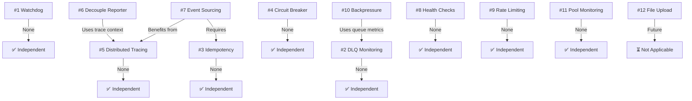
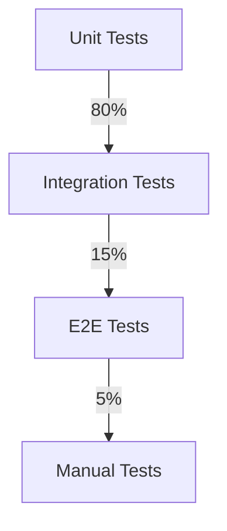
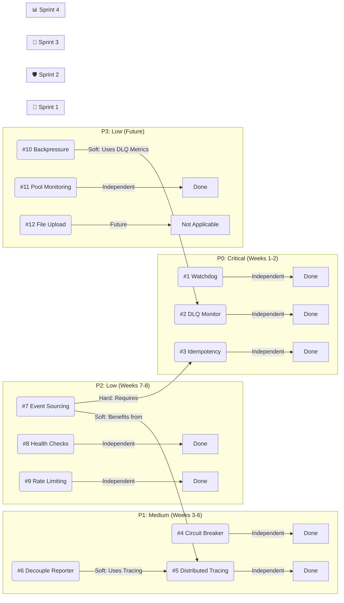

# Attackbot v1 — Technical Issue Resolution Sprint Plan

> **Document Type:** Implementation Roadmap  
> **Target Audience:** Engineering Managers, Senior Engineers, Architects, QA Team  
> **Date:** 2026-04-19  
> **Branch:** M4_ReadTheRoom  
> **Status:** Draft  

---

## Table of Contents

1. [Executive Summary](#executive-summary)
2. [Methodology](#methodology)
   - [Why Sprint-Based Approach](#why-sprint-based-approach)
   - [Why Not Strict 2+2](#why-not-strict-22)
   - [Guiding Principles](#guiding-principles)
3. [Issue Inventory & Priority Matrix](#issue-inventory--priority-matrix)
4. [Dependency Analysis](#dependency-analysis)
5. [Sprint Breakdown](#sprint-breakdown)
   - [🚨 Sprint 1: P0 - Data Integrity (Weeks 1-2)](#-sprint-1-p0---data-integrity-weeks-1-2)
   - [🛡️ Sprint 2: P0/P1 - Resilience Foundation (Weeks 3-4)](#-sprint-2-p0p1---resilience-foundation-weeks-3-4)
   - [🔄 Sprint 3: P1 - Architecture Modernization (Weeks 5-6)](#-sprint-3-p1---architecture-modernization-weeks-5-6)
   - [📊 Sprint 4: P2 - Operational Excellence (Weeks 7-8)](#-sprint-4-p2---operational-excellence-weeks-7-8)
   - [⏭️ Sprint 5+: Future Enhancements](#-sprint-5-future-enhancements)
6. [Risk Assessment](#risk-assessment)
7. [Resource Allocation](#resource-allocation)
8. [Success Criteria & Metrics](#success-criteria--metrics)
9. [Testing Strategy](#testing-strategy)
10. [Rollback & Contingency Plans](#rollback--contingency-plans)
11. [Appendices](#appendices)
    - [A: Issue Details Reference](#a-issue-details-reference)
    - [B: File Modification Matrix](#b-file-modification-matrix)
    - [C: Dependency Graph](#c-dependency-graph)
    - [D: Glossary](#d-glossary)

---

## Executive Summary

This document outlines a **dependency-aware sprint plan** for resolving the 12 technical issues identified in Issues#1.md and Issues#2.md. The plan prioritizes **data integrity** (P0) and **resilience** (P1) over **architectural** (P2) and **optimization** (P3) improvements, delivering incremental value while respecting critical dependencies between issues.

### Key Outcomes

| Phase | Duration | Primary Focus | Business Value |
|-------|----------|---------------|----------------|
| Sprint 1 | Weeks 1-2 | Prevent data loss | **Critical** — Eliminates stuck scans, duplicate processing |
| Sprint 2 | Weeks 3-4 | Enable observability & resilience | **High** — Prevents cascading failures, adds traceability |
| Sprint 3 | Weeks 5-6 | Decouple architecture | **Medium** — Improves scalability, reduces coupling |
| Sprint 4 | Weeks 7-8 | Operational maturity | **Low** — Production hardening, monitoring |

### Total Estimated Effort

| Category | Issues | Total Effort | Team Weeks |
|----------|--------|--------------|------------|
| P0 (Critical) | #1, #2, #3 | 18-24h | 2.5 weeks |
| P1 (Medium) | #4, #5, #6 | 14-20h | 2 weeks |
| P2 (Low) | #7, #8, #9 | 16-20h | 2.5 weeks |
| P3 (Low) | #10, #11, #12 | 8-14h | 1.5 weeks |
| **Total** | **12** | **~70-80h** | **8-8.5 weeks** |

> **Assumption:** 1 engineer working full-time = 40h/week. With 2 engineers, timeline halves to **4-4.5 weeks**.

---

## Methodology

### Why Sprint-Based Approach

1. **Predictable Delivery**
   -Each sprint delivers **shippable, testable** increments
   -Stakeholders can plan around known milestones

2. **Risk Containment**
   -Issues isolated to sprints prevent **catastrophic failures** across entire codebase
   -If a sprint overruns, only that sprint's issues are affected

3. **Focus & Momentum**
   -2-week sprints maintain urgency without burnout
   -Clear start/end dates prevent scope creep

4. **Continuous Feedback**
   -Retrospectives after each sprint allow **course correction**
   -Production metrics validate each sprint's impact

### Why Not Strict 2+2

While the proposed **2 severe + 2 less severe** framework is sound, it has limitations:

| Limitation | Impact | Solution |
|------------|--------|----------|
| **Severity ≠ Complexity** | Pairs 10h issue with another 10h issue = sprint failure risk | Group by effort, not just severity |
| **Ignore Dependencies** | May start #7 (Event Sourcing) before #3 (Idempotency) is done | Sequence by dependency |
| **Rigid Pairings** | Forces unrelated issues together | Allow natural pairings (e.g., #4 + #5) |
| **P0 Delay** | Spreads critical issues across multiple sprints | Concentrate P0 in earliest sprints |

### Guiding Principles

1. **🔴 P0 First** — Data loss issues must be resolved **before** any other work
2. **🔄 Respect Dependencies** — Never start work that depends on unfinished items
3. **🎯 Natural Pairings** — Group issues that share code, concepts, or testing needs
4. **⚖️ Balance Effort** — Each sprint should have **~16-24h** of work per engineer
5. **📊 Deliver Value** — Every sprint must ship something **measurably better**
6. **🛡️ Fail Fast** — If a sprint is at risk, descope **lowest-priority** items first

---

## Issue Inventory & Priority Matrix

### Complete Issue List

| # | Issue | Category | Severity | Effort | Prio | Sprint | Status |
|---|-------|----------|----------|--------|------|--------|--------|
| 1 | Watchdog Scan Recovery Mechanism Failure | Critical | 🔴 | 4-6h | P0 | 1 | ✅ Planned |
| 2 | Dead Letter Queue Blind Spot | Critical | 🔴 | 6-8h | P0 | 1-2 | ✅ Planned |
| 3 | Idempotency Guarantee Gaps | Critical | 🔴 | 8-10h | P0 | 1 | ✅ Planned |
| 4 | Missing Circuit Breaker Pattern | Architectural | 🟡 | 4-6h | P1 | 2 | ✅ Planned |
| 5 | Lack of Distributed Tracing | Architectural | 🟡 | 6-8h | P1 | 2 | ✅ Planned |
| 6 | Synchronous Inter-Service Dependencies | Architectural | 🟡 | 4-6h | P1 | 3 | ✅ Planned |
| 7 | Absence of Event Sourcing | Strategic | 🟢 | 10-15h | P2 | 3 | ✅ Planned |
| 8 | Health Check False Positives | Operational | 🟢 | 4-6h | P2 | 4 | ✅ Planned |
| 9 | Missing API Rate Limiting | Operational | 🟢 | 2-4h | P2 | 4 | ✅ Planned |
| 10 | No Backpressure Mechanism | Operational | 🟢 | 4-6h | P3 | 4 | ✅ Planned |
| 11 | Database Connection Pool Monitoring Gap | Operational | 🟢 | 2-4h | P3 | 4 | ✅ Planned |
| 12 | File Upload Size Validation Timing | Operational | 🟢 | 2-4h | P3 | Future | ⏳ Backlog |

### Priority Definitions

| Priority | Definition | SLA | Example |
|----------|------------|-----|---------|
| **P0** | Causes **data loss** or **system outage** | Immediate | Watchdog, DLQ, Idempotency |
| **P1** | Causes **degraded performance** or **debugging difficulties** | Within 2 sprints | Circuit Breaker, Tracing |
| **P2** | **Operational overhead** or **compliance gaps** | Within release | Health Checks, Rate Limiting |
| **P3** | **Nice-to-have** or **future-proofing** | Backlog | Backpressure, File Upload |

---

## Dependency Analysis

### Critical Dependencies

### Dependency Rules

| Issue | Depends On |Blocking? | Reason |
|-------|------------|----------|--------|
| #6 | #5 | **Soft** | Tracing context makes decoupling cleaner |
| #7 | #3 | **Hard** | Idempotency keys track processed events |
| #7 | #5 | **Soft** | Trace context provides event correlation |
| #10 | #2 | **Soft** | DLQ depth metrics inform backpressure |
| All others | None | No | Independent |

> **🔒 Hard Dependency:** Cannot start until dependency is complete  
> **⚪ Soft Dependency:** Can start, but implementation is harder/cleaner with dependency

### Natural Pairings (Non-Dependency)

| Pair | Why Together | Benefit |
|------|---------------|---------|
| **#4 + #5** | Circuit breaker behavior is easier to debug with tracing | Faster debugging, better observability |
| **#6 + #5** | Decoupling Reporter benefits from trace context propagation | Unified request flow |
| **#8 + #11** | Both are monitoring improvements, share Prometheus setup | Reduced setup overhead |
| **#10 + #2** | Backpressure uses DLQ metrics for queue health | Cohesive queue management |

---

## Sprint Breakdown

---

### 🚨 Sprint 1: P0 - Data Integrity (Weeks 1-2)

**Theme:** *Eliminate data loss and stuck state*  
**Business Impact:** **Critical** — Prevents scan data loss, duplicate processing, and message loss  
**Sprint Goal:** All scans complete successfully, no duplicates, full visibility into failures

| Issue | Priority | Effort | Assignee | Status | Start | End |
|-------|----------|--------|----------|--------|-------|-----|
| #1 | P0 | 4-6h | Engineer A | Not Started | Day 1 | Day 2 |
| #3 | P0 | 8-10h | Engineer A | Not Started | Day 1 | Day 5 |
| #2 | P0 | 6-8h | Engineer B | Not Started | Day 3 | Day 5 |

#### Issue #1: Watchdog Scan Recovery Mechanism Failure

**Objective:** Ensure watchdog reliably marks stuck scans as `failed_internal` and provides full observability.

**Implementation Plan:**

| Day | Task | Files | Effort |
|-----|------|-------|--------|
| 1 | Add Prometheus metrics to watchdog | `watchdog.py` | 1h |
| 1 | Add comprehensive logging (start/end/in-progress) | `watchdog.py` | 1h |
| 1 | Fix silent exception handling (re-raise after logging) | `watchdog.py` | 1h |
| 1 | Add startup verification of watchdog job | `main.py` | 1h |
| 2 | Add time zone-aware timestamp validation | `watchdog.py`, `alembic/versions/005_...py` | 2h |
| 2 | Test watchdog with stuck scan simulation | Test scripts | 2h |

**Acceptance Criteria:**
- [ ] `watchdog_executions_total` metric increments on every run
- [ ] `watchdog_scans_recovered_total` metric increments per recovered scan
- [ ] Watchdog logs: start time, threshold, scans found, recovery actions, completion
- [ ] Startup fails if watchdog job not registered
- [ ] Stuck scan test: Inject a scan stuck for >2h, verify auto-recovery
- [ ] Timezone test: Verify UTC timestamps in DB and code

**Risk:** Low — Changes are additive (enhancements only)

---

#### Issue #2: Dead Letter Queue Blind Spot

**Objective:** Full visibility into DLQ state with automatic monitoring and recovery.

**Implementation Plan:**

| Day | Task | Files | Effort |
|-----|------|-------|--------|
| 3 | Create DLQMonitor service class | `shared/dlq_monitor.py` | 3h |
| 3 | Add Prometheus metrics for DLQ depth | `shared/dlq_monitor.py` | 1h |
| 4 | Implement scheduled monitoring job | `main.py` (both services) | 2h |
| 4 | Add API endpoints for DLQ inspection | `main.py` (Core Engine) | 2h |
| 5 | Test DLQ monitoring with injected failures | Test scripts | 2h |

**Acceptance Criteria:**
- [ ] `rabbitmq_dlq_depth` metric per queue
- [ ] Scheduled job runs every 60s
- [ ] Grafana alert triggers when DLQ depth > 0 for 5min
- [ ] API endpoint: `GET /api/v1/queue/dlq/monitor` returns all DLQ depths
- [ ] API endpoint: `GET /api/v1/queue/dlq/{name}/inspect` returns messages
- [ ] Failure injection: Force a message to DLQ, verify detection

**Risk:** Medium — Requires RabbitMQ access and configuration changes

---

#### Issue #3: Idempotency Guarantee Gaps

**Objective:** Prevent duplicate processing of redelivered messages.

**Implementation Plan:**

| Day | Task | Files | Effort |
|-----|------|-------|--------|
| 1 | Create idempotency_keys table migration | `alembic/versions/006_...py` | 1h |
| 2 | Implement IdempotencyService | `shared/idempotency.py` | 3h |
| 3 | Create with_idempotency decorator | `shared/idempotency.py` | 2h |
| 4 | Integrate with Core Worker | `core_engine/worker.py` | 2h |
| 4 | Integrate with Reporter Worker | `reporter/worker.py` | 2h |
| 5 | Add cleanup job for expired keys | `shared/jobs/idempotency_cleanup.py` | 1h |

**Acceptance Criteria:**
- [ ] `idempotency_keys` table exists with proper indexes
- [ ] IdempotencyService.check_and_record() prevents duplicate processing
- [ ] with_idempotency() wrapper caches responses
- [ ] Core Worker rejects duplicate scan messages
- [ ] Reporter Worker rejects duplicate report messages
- [ ] Test: Process same message twice, verify second is ignored
- [ ] Cleanup job removes keys older than 7 days

**Risk:** Medium — Database schema change requires migration

---

### Sprint 1 Outcomes

| Metric | Before | Target | Measurement |
|--------|--------|--------|-------------|
| Stuck scans >2h | Unknown | **0** | Prometheus: `stuck_scans_current` |
| Message redelivery | Duplicate processing | **0 duplicates** | DB: `idempotency_keys` table |
| DLQ visibility | None | **Full visibility** | API + Grafana |
| Watchdog reliability | Silent failures | **100% execution** | Prometheus: `watchdog_executions_total` |

---

---

### 🛡️ Sprint 2: P0/P1 - Resilience Foundation (Weeks 3-4)

**Theme:** *Prevent cascading failures and enable cross-service debugging*  
**Business Impact:** **High** — Improves system reliability and debugging speed  
**Sprint Goal:** Services fail gracefully, all requests are traceable across boundaries

| Issue | Priority | Effort | Assignee | Status | Start | End |
|-------|----------|--------|----------|--------|-------|-----|
| #2 | P0 | 6-8h | Engineer B | *If not done in S1* | Day 1 | Day 2 |
| #4 | P1 | 4-6h | Engineer A | Not Started | Day 1 | Day 3 |
| #5 | P1 | 6-8h | Engineer B | Not Started | Day 3 | Day 5 |

#### Issue #4: Missing Circuit Breaker Pattern

**Objective:** Prevent cascading failures when downstream services are unavailable.

**Implementation Plan:**

| Day | Task | Files | Effort |
|-----|------|-------|--------|
| 1 | Install `aiobreaker` library | `requirements.txt` | 0.5h |
| 1 | Create ServiceCircuitBreakers registry | `shared/circuit_breaker.py` | 2h |
| 1 | Add Prometheus metrics for circuit state | `shared/circuit_breaker.py` | 1h |
| 2 | Add state change event listeners (logging + metrics) | `shared/circuit_breaker.py` | 1h |
| 2 | Decorate Core Engine → Scraper HTTP calls | `core_engine/main.py` | 1h |
| 3 | Decorate Reporter → Core Engine HTTP calls | `reporter/clients/core_engine.py` | 1h |
| 3 | Add admin endpoints for circuit breaker status | `core_engine/main.py` | 1h |

**Acceptance Criteria:**
- [ ] Circuit breakers configured for: scraper_api, core_engine_api, hackerone_api
- [ ] `circuit_breaker_state` metric per service
- [ ] `circuit_breaker_transitions_total` metric tracks state changes
- [ ] Circus opens after 5 failures, stays open for 60s
- [ ] Service returns 503 when circuit is open
- [ ] Admin endpoint: `GET /api/v1/circuit-breakers` returns all states
- [ ] Admin endpoint: `POST /api/v1/circuit-breakers/reset` resets all
- [ ] Test: Take down Core Engine, verify Reporter fails fast with 503

**Risk:** Low — Changes are additive (new layer on top of existing HTTP calls)

---

#### Issue #5: Lack of Distributed Tracing

**Objective:** Full cross-service request tracing for debugging and latency analysis.

**Implementation Plan:**

| Day | Task | Files | Effort |
|-----|------|-------|--------|
| 3 | Install OpenTelemetry packages | `requirements.txt` (all services) | 1h |
| 3 | Create tracing initialization module | `shared/tracing.py` | 2h |
| 4 | Add trace context to MessageEnvelope | `shared/schemas/envelope.py` | 1h |
| 4 | Instrument FastAPI (auto) | All `main.py` | 1h |
| 5 | Instrument httpx (auto) | `shared/tracing.py` | 1h |
| 5 | Instrument Celery (auto) | `shared/tracing.py` | 1h |
| 5 | Deploy Jaeger (Docker) | `docker-compose.yml` | 1h |

**Acceptance Criteria:**
- [ ] Jaeger all-in-one container running on port 16686
- [ ] All services emit spans to Jaeger
- [ ] Trace context propagated via MessageEnvelope (trace_id, span_id)
- [ ] HTTP calls between services show parent/child relationship
- [ ] Query Jaeger: Search for scan_id, see complete request flow
- [ ] Test: Start scan, verify trace visible in Jaeger
- [ ] Latency: Measure end-to-end scan time in Jaeger

**Risk:** Medium — New infrastructure (Jaeger), requires Docker changes

---

### Sprint 2 Outcomes

| Metric | Before | Target | Measurement |
|--------|--------|--------|-------------|
| Cascading failures | Services timeout after 30-60s | **Fail fast in <1ms** | Circuit breaker metrics |
| Cross-service debugging | Manual log correlation | **Single trace view** | Jaeger UI |
| Request latency visibility | None | **Per-span timing** | Jaeger flame graphs |
| Service dependency graph | None | **Automatic** | Jaeger dependency view |

---

---

### 🔄 Sprint 3: P1 - Architecture Modernization (Weeks 5-6)

**Theme:** *Decouple services and enable event-driven architecture*  
**Business Impact:** **Medium** — Improves scalability and reduces tight coupling  
**Sprint Goal:** Reporter is self-contained, scan state changes are auditable

| Issue | Priority | Effort | Assignee | Status | Start | End |
|-------|----------|--------|----------|--------|-------|-----|
| #6 | P1 | 4-6h | Engineer A | Not Started | Day 1 | Day 3 |
| #7 | P2 | 10-15h | Engineer B | Not Started | Day 1 | Day 6 |

#### Issue #6: Synchronous Inter-Service Dependencies

**Objective:** Eliminate Reporter's HTTP calls to Core Engine by embedding data in messages.

**Implementation Plan:**

| Day | Task | Files | Effort |
|-----|------|-------|--------|
| 1 | Extend ReportJobsPayload with embedded data | `shared/schemas/report_jobs.py` | 2h |
| 1 | Add scan_summary, findings, evidence to payload | `shared/schemas/report_jobs.py` | 2h |
| 2 | Update Aggregator (Stage 10) to include data in message | `core_engine/pipeline/aggregator.py` | 3h |
| 3 | Remove HTTP calls from Reporter | `reporter/clients/core_engine.py` | 1h |
| 3 | Update Reporter Worker to use embedded data | `reporter/worker.py` | 2h |
| 3 | Test performance: Compare old vs new | Benchmark scripts | 2h |

**Acceptance Criteria:**
- [ ] ReportJobsPayload includes: scan_summary, findings, evidence
- [ ] Core Engine populates embedded data in Stage 10
- [ ] Reporter Worker uses embedded data (no HTTP calls)
- [ ] Performance: 100 findings = <500ms (vs 15s with HTTP)
- [ ] Backward compatibility: Old messages still work (graceful degradation)
- [ ] Test: Generate report with embedded data, verify correctness

**Risk:** Medium — Schema change requires coordination between services

---

#### Issue #7: Absence of Event Sourcing

**Objective:** Persist all domain events for audit trail and state reconstruction.

**Implementation Plan:**

| Day | Task | Files | Effort |
|-----|------|-------|--------|
| 1 | Create domain_events table migration | `alembic/versions/007_...py` | 2h |
| 2 | Implement EventStore service | `shared/event_sourcing/event_store.py` | 3h |
| 3 | Add event recording to ScanRepository | `core_engine/repository.py` | 3h |
| 4 | Add audit endpoints for events | `core_engine/main.py` | 2h |
| 5 | Add temporal query support | `core_engine/main.py` | 2h |
| 6 | Test: Rebuild scan state from events | Test scripts | 3h |

**Acceptance Criteria:**
- [ ] `domain_events` table with proper indexes
- [ ] EventStore.append_event() persists events with sequence numbers
- [ ] ScanRepository records events for: ScanCreated, ScanStarted, StageCompleted, FindingCreated, ScanCompleted
- [ ] API: `GET /api/v1/scans/{scan_id}/events` returns event history
- [ ] API: `GET /api/v1/scans/{scan_id}/state-at?at_time=...` returns historical state
- [ ] API: `GET /api/v1/audit/findings-created?from=...&to=...` returns audit trail
- [ ] Test: Delete scan row, rebuild from events

**Risk:** High — Probability of **Sprint 4 spillover** due to complexity

**Contingency:** If not complete by end of Sprint 3, move to Sprint 4 and reduce scope (implement for Scans only, not all aggregates).

---

### Sprint 3 Outcomes

| Metric | Before | Target | Measurement |
|--------|--------|--------|-------------|
| Reporter → Core Engine calls | 300+/report | **0** | Code audit |
| Report generation time (100 findings) | 15-60s | **<500ms** | Prometheus: report_generation_duration |
| Audit trail | Limited | **Complete event history** | API: /scans/{id}/events |
| State reconstruction | Impossible | **Replay from events** | Test: rebuild scan state |

---

---

### 📊 Sprint 4: P2 - Operational Excellence (Weeks 7-8)

**Theme:** *Production hardening and monitoring*  
**Business Impact:** **Low** — Improves operational visibility and control  
**Sprint Goal:** Full production observability and reliable health checks

| Issue | Priority | Effort | Assignee | Status | Start | End |
|-------|----------|--------|----------|--------|-------|-----|
| #8 | P2 | 4-6h | Engineer A | Not Started | Day 1 | Day 2 |
| #9 | P2 | 2-4h | Engineer A | Not Started | Day 2 | Day 3 |
| #10 | P3 | 4-6h | Engineer B | Not Started | Day 3 | Day 5 |
| #11 | P3 | 2-4h | Engineer B | Not Started | Day 5 | Day 6 |

#### Issue #8: Health Check False Positives

**Objective:** Health checks validate actual functionality, not just connectivity.

**Implementation Plan:**

| Day | Task | Files | Effort |
|-----|------|-------|--------|
| 1 | Enhance DB health check (schema, write test, pool) | `shared/db.py` | 2h |
| 1 | Add health_check table migration | `alembic/versions/008_...py` | 1h |
| 1 | Enhance RabbitMQ health check (queues, publish) | `shared/queue.py` | 2h |
| 2 | Enhance MinIO health check (buckets, write) | `shared/storage.py` | 1h |
| 2 | Update all services to use enhanced checks | All `main.py` | 2h |

**Acceptance Criteria:**
- [ ] DB check: `SELECT 1` + schema verification + write test + pool status
- [ ] RabbitMQ check: connection + queue existence + publish test
- [ ] MinIO check: connection + bucket existence + write test + delete test
- [ ] All services use enhanced health checks
- [ ] ComponentHealth includes: status, latency_ms, detail
- [ ] Test: Delete a required queue, verify health check fails
- [ ] Test: Exhaust DB pool, verify health check degrades

---

#### Issue #9: Missing API Rate Limiting

**Objective:** Protect API endpoints from abuse and DDoS.

**Implementation Plan:**

| Day | Task | Files | Effort |
|-----|------|-------|--------|
| 2 | Install `slowapi` or `fastapi-limiter` | `requirements.txt` | 0.5h |
| 2 | Create rate limiting middleware | `shared/rate_limiter.py` | 1h |
| 2 | Configure rate limits per endpoint | All `main.py` | 2h |
| 3 | Add Prometheus metrics for rate limiting | `shared/rate_limiter.py` | 1h |

**Acceptance Criteria:**
- [ ] Rate limiting configured on all mutable endpoints
- [ ] Default: 100 requests/minute per IP
- [ ] Scan start: 10 requests/minute per IP (prevents spam)
- [ ] Returns 429 with Retry-After header when limited
- [ ] Metric: `api_rate_limit_hits_total` per endpoint
- [ ] Test: Send 11 requests to /scans/start in 1 second, verify 10 succeed, 1 fails with 429

---

#### Issue #10: No Backpressure Mechanism

**Objective:** Prevent unbounded queue growth when consumers are slow.

**Implementation Plan:**

| Day | Task | Files | Effort |
|-----|------|-------|--------|
| 3 | Add queue depth checking to publish | `shared/queue.py` | 1h |
| 4 | Configure max_queue_depth per queue | `config.py` | 1h |
| 4 | Add Prometheus metric for rejections | `shared/queue.py` | 1h |
| 5 | Add backpressure to all publishers | All services | 2h |

**Acceptance Criteria:**
- [ ] `max_queue_depth` configurable per queue (default: 1000)
- [ ] Publish returns False when queue depth > max
- [ ] Metric: `queue_backpressure_rejections_total` per queue
- [ ] API: Queue depth included in health check components
- [ ] Test: Fill queue to max, verify new messages rejected

---

#### Issue #11: Database Connection Pool Monitoring Gap

**Objective:** Full visibility into PostgreSQL connection pool state.

**Implementation Plan:**

| Day | Task | Files | Effort |
|-----|------|-------|--------|
| 5 | Add Prometheus gauges for pool metrics | `shared/db.py` | 1h |
| 5 | Update get_session to emit metrics | `shared/db.py` | 1h |
| 6 | Add Grafana alerts for pool exhaustion | `grafana/alerts/...yml` | 1h |
| 6 | Document pool sizing guidelines | `docs/ops/db_pool.md` | 1h |

**Acceptance Criteria:**
- [ ] Metric: `db_pool_size` (configured pool size)
- [ ] Metric: `db_pool_checked_out` (active connections)
- [ ] Metric: `db_pool_overflow` (overflow connections)
- [ ] Metric: `db_pool_wait_time_seconds` (average wait time)
- [ ] Grafana alert: ConnectionPoolExhausted when overflow > 15
- [ ] Test: Set pool_size=2, open 3 sessions, verify overflow=1

---

### Sprint 4 Outcomes

| Metric | Before | Target | Measurement |
|--------|--------|--------|-------------|
| Health check false positives | Unknown | **0/week** | Manual validation |
| API abuse protection | None | **Rate limited** | 429 responses tracked |
| Queue growth | Unbounded | **Capped at max_depth** | Rejection counter |
| Pool exhaustion visibility | None | **Full metrics** | Prometheus + Grafana |

---

---

### ⏭️ Sprint 5+: Future Enhancements

**Issues to be scheduled based on priority:**

| Issue | Priority | Effort | Dependencies | Notes |
|-------|----------|--------|--------------|-------|
| #12 | P3 | 2-4h | None | Requires file upload API (not yet planned) |

**Recommendation:** Address when implementing user-facing file upload endpoints.

---

---

## Risk Assessment

### Sprint-Level Risks

| Sprint | Risk | Probability | Impact | Mitigation |
|--------|------|-------------|--------|------------|
| **Sprint 1** | Database migration fails | Low | High | Test migrations in staging before production |
| **Sprint 1** | Watchdog changes cause stuck scans | Low | High | Canary deploy, monitor stuck_scan metric |
| **Sprint 2** | Jaeger deployment issues | Medium | Medium | Use Jaeger all-in-one Docker image |
| **Sprint 2** | Circuit breaker opens too aggressively | Medium | Medium | Start with fail_max=10, tune based on metrics |
| **Sprint 3** | Event Sourcing scope creep | High | Low | **(Marked for contingency)** Spill to Sprint 4, reduce scope |
| **Sprint 4** | Rate limiting too restrictive | Medium | Medium | Start with generous limits, monitor 429s |

### Cross-Sprint Risks

| Risk | Description | Mitigation |
|------|-------------|------------|
| **Integration Issues** | Changes in one sprint break work from another | Comprehensive integration testing after each sprint |
| **Testing Gaps** | New features lack adequate test coverage | Mandate: 1 test per acceptance criterion |
| **Documentation Debt** | knowledge not captured | Assign documentation tasks alongside implementation |
| **Dependency Conflicts** | Library version conflicts | Use `pip-tools` for consistent dependency management |

---

---

## Resource Allocation

### Team Composition

| Role | Count | Responsibilities |
|------|-------|------------------|
| Senior Backend Engineer | 2 | Primary implementation, architecture |
| DevOps Engineer | 1 (Part-time) | Jaeger deployment, monitoring, alerts |
| QA Engineer | 1 | Test case design, automated testing |
| Engineering Manager | 1 | Sprint planning, risk management |

### Effort Distribution

| Sprint | Engineer A | Engineer B | DevOps | QA | Total |
|--------|------------|------------|--------|----|-------|
| Sprint 1 | #1, #3 (14-16h) | #2 (6-8h) + Support | - | 8h | ~40h |
| Sprint 2 | #4, #5 (10-14h) | #2 (if needed), Support | Jaeger (1h) | 8h | ~40h |
| Sprint 3 | #6 (4-6h) | #7 (10-15h) | - | 8h | ~40h |
| Sprint 4 | #8, #9, #11 (8-14h) | #10 (4-6h) | Alerts (1h) | 8h | ~40h |

> **Note:** QA effort is consistent at ~8h/sprint for regression testing and new feature validation.

---

### Tools & Infrastructure Requirements

| Tool | Purpose | Sprint | Owner |
|------|---------|--------|-------|
| Jaeger | Distributed tracing | Sprint 2 | DevOps |
| Prometheus + Grafana | Metrics & Alerts | Sprint 1 | DevOps |
| PostgreSQL | Event store, idempotency | All | DBA |
| RabbitMQ | DLQ testing | Sprint 1 | DevOps |
| MinIO | Health check testing | Sprint 1 | DevOps |
| Redis | Rate limiting (optional) | Sprint 4 | DevOps |

---

---

## Success Criteria & Metrics

### Overall Success Metrics

| Category | Metric | Target | Baseline | Measurement |
|----------|--------|--------|----------|-------------|
| **Reliability** | Stuck scans (>2h) | **0** | Unknown | `stuck_scans_current` |
| **Reliability** | Duplicate message processing | **0%** | Unknown | `idempotency_keys` table |
| **Reliability** | Messages in DLQ (>5min) | **0** | Unknown | `rabbitmq_dlq_depth` |
| **Performance** | Report generation time (100 findings) | **<500ms** | 15-60s | Prometheus histogram |
| **Observability** | Trace coverage | **100%** | 0% | Jaeger UI |
| **Observability** | Health check false positives | **0/week** | Unknown | Manual audit |
| **Security** | API abuse protection | **100% of endpoints** | 0% | 429 response tracking |

---

### Per-Sprint Success Criteria

#### Sprint 1
- [ ] Zero stuck scans in production after deployment
- [ ] All messages processed exactly once (no duplicates)
- [ ] DLQ messages visible in Grafana
- [ ] Watchdog execution logged and metered

#### Sprint 2
- [ ] Circuit breaker prevents >5 consecutive failures to any service
- [ ] All requests traceable in Jaeger
- [ ] Cross-service latency visible in Jaeger
- [ ] Service failure results in <1ms rejection (vs 30-60s timeout)

#### Sprint 3
- [ ] Reporter generates reports without HTTP calls to Core Engine
- [ ] Report generation time for 100 findings <500ms
- [ ] Scan event history queryable via API
- [ ] Scan state rebuildable from events (test)

#### Sprint 4
- [ ] Zero health check false positives in production
- [ ] All API endpoints rate limited
- [ ] Queue depth visible in health checks
- [ ] Connection pool metrics in Prometheus

---

---

## Testing Strategy

### Testing Pyramid

| Layer | Coverage | Examples |
|-------|----------|----------|
| **Unit** | 80% | Individual functions, services |
| **Integration** | 15% | Message flows, DB interactions |
| **E2E** | 5% | Full scan → report flow, DLQ recovery |
| **Manual** | Ad-hoc | Exploratory testing, edge cases |

### Test Approach per Issue

| Issue | Unit Tests | Integration Tests | E2E Tests | Manual Tests |
|-------|------------|------------------|-----------|--------------|
| #1 Watchdog | ✅ Threshold calculation, scan marking | ✅ Watchdog + DB | ❌ | ✅ Stuck scan injection |
| #2 DLQ Monitor | ✅ Message classification | ✅ Monitor + RabbitMQ | ✅ DLQ injection | ❌ |
| #3 Idempotency | ✅ Check/record logic | ✅ Message redelivery | ✅ Duplicate message | ❌ |
| #4 Circuit Breaker | ✅ State transitions | ✅ Breaker + HTTP client | ❌ | ✅ Downstream failure |
| #5 Tracing | ✅ Context propagation | ✅ Multi-service span | ✅ Full trace | ❌ |
| #6 Decouple Reporter | ✅ Payload parsing | ✅ Reporter + embedded data | ✅ Report generation | ❌ |
| #7 Event Sourcing | ✅ Event append/query | ✅ Event replay | ✅ State rebuild | ❌ |
| #8 Health Checks | ✅ Individual checks | ✅ Component interaction | ❌ | ✅ Fail scenario |
| #9 Rate Limiting | ✅ Limit calculation | ✅ Apply to endpoint | ❌ | ✅Burst test |
| #10 Backpressure | ✅ Queue depth check | ✅ Publisher + queue | ❌ | ✅ Fill queue |
| #11 Pool Monitoring | ✅ Metric emission | ✅ Pool usage tracking | ❌ | ✅ Exhaust pool |

---

### Test Environments

| Environment | Purpose | Data | Services |
|-------------|---------|------|----------|
| **Local** | Development, unit tests | Mocked | Single service |
| **Integration** | Integration tests | Real | All services |
| **Staging** | E2E tests, pre-prod validation | Real | All services + Jaeger |
| **Production** | Canary, monitoring | Real | Incremental rollout |

---

---

## Rollback & Contingency Plans

### Per-Sprint Contingency

| Sprint | Risk | Contingency |
|--------|------|-------------|
| **Sprint 1** | Issues too large for sprint | Descope #2 (DLQ) to Sprint 2, deliver #1 + #3 |
| **Sprint 2** | Tracing or CB too complex | Deliver #2 (if from S1) + #4, defer #5 to Sprint 3 |
| **Sprint 3** | Event Sourcing too large | Deliver #6, spill #7 to Sprint 4 |
| **Sprint 4** | Rate limiting/backpressure complex | Deliver #8 + #9, spill #10/#11 to Sprint 5 |

### Per-Issue Rollback

| Issue | Rollback Strategy | Time to Rollback |
|-------|-------------------|------------------|
| #1 Watchdog | Revert to original watchdog.py | <5min |
| #2 DLQ Monitor | Disable scheduled job, remove endpoints | <5min |
| #3 Idempotency | Drop idempotency_keys table, revert wrapper | <10min |
| #4 Circuit Breaker | Remove decorator, revert to direct calls | <10min |
| #5 Tracing | Disable OpenTelemetry instrumentation | <5min |
| #6 Decouple Reporter | Revert payload schema, restore HTTP calls | <15min |
| #7 Event Sourcing | Drop domain_events table, remove event recording | <10min |
| #8 Health Checks | Revert to simple checks | <5min |
| #9 Rate Limiting | Remove middleware | <5min |
| #10 Backpressure | Remove queue depth check | <5min |
| #11 Pool Monitoring | Remove metrics, revert get_session | <5min |

### Rollback Triggers

| Severity | Trigger | Action |
|----------|---------|--------|
| **Critical** | Production down | Immediate rollback of last deployment |
| **High** | P0 issue in production | Rollback within 1 hour |
| **Medium** | P1 issue in production | Rollback within 4 hours |
| **Low** | P2/P3 issue in production | Fix forward in next sprint |

---

---

## Appendices

---

### A: Issue Details Reference

| # | Title | Category | Severity | Description | Files |
|---|-------|----------|----------|-------------|-------|
| 1 | Watchdog Scan Recovery Mechanism Failure | Critical | 🔴 | Watchdog doesn't reliably mark stuck scans, lacks metrics/logging | `watchdog.py`, `main.py` |
| 2 | Dead Letter Queue Blind Spot | Critical | 🔴 | No monitoring, alerting, or recovery for DLQ messages | `queue.py`, all workers |
| 3 | Idempotency Guarantee Gaps | Critical | 🔴 | Messages can be redelivered causing duplicate processing | All workers, `envelope.py` |
| 4 | Missing Circuit Breaker Pattern | Architectural | 🟡 | Services wait full timeout for unavailable dependencies | HTTP clients, all services |
| 5 | Lack of Distributed Tracing | Architectural | 🟡 | Cannot trace requests across service boundaries | All services |
| 6 | Synchronous Inter-Service Dependencies | Architectural | 🟡 | Reporter makes 300+ HTTP calls to Core Engine per report | `reporter/clients/core_engine.py` |
| 7 | Absence of Event Sourcing | Strategic | 🟢 | Cannot audit state changes or rebuild state | All repositories |
| 8 | Health Check False Positives | Operational | 🟢 | Health checks only test connectivity, not functionality | `db.py`, `queue.py`, `storage.py` |
| 9 | Missing API Rate Limiting | Operational | 🟢 | No protection against API abuse | All FastAPI endpoints |
| 10 | No Backpressure Mechanism | Operational | 🟢 | Publishers keep publishing regardless of queue depth | `queue.py`, all publishers |
| 11 | Database Connection Pool Monitoring Gap | Operational | 🟢 | No metrics for pool size, checked out, overflow | `db.py` |
| 12 | File Upload Size Validation Timing | Operational | 🟢 | Large files uploaded before size validation | Future API endpoints |

---

---

### B: File Modification Matrix

| File | Issues | Changes | Risk |
|------|--------|---------|------|
| `backend/shared/tracing.py` | #5 | NEW - OpenTelemetry init | Low |
| `backend/shared/circuit_breaker.py` | #4 | NEW - Circuit breaker service | Low |
| `backend/shared/idempotency.py` | #3 | NEW - Idempotency service | Low |
| `backend/shared/models/idempotency.py` | #3 | NEW - DB model | Low |
| `backend/shared/dlq_monitor.py` | #2 | NEW - DLQ monitoring | Low |
| `backend/shared/rate_limiter.py` | #9 | NEW - Rate limiting | Low |
| `backend/shared/event_sourcing/event_store.py` | #7 | NEW - Event store | Medium |
| `backend/shared/models/event_store.py` | #7 | NEW - DB model | Low |
| `backend/shared/db.py` | #8, #11 | MODIFY - Enhanced health + pool metrics | Medium |
| `backend/shared/queue.py` | #2, #8, #10 | MODIFY - DLQ inspection + backpressure | Medium |
| `backend/shared/health.py` | #8 | MODIFY - Enhanced ComponentHealth | Low |
| `backend/shared/schemas/envelope.py` | #3, #5 | MODIFY - Add trace_id/span_id | Low |
| `backend/shared/schemas/report_jobs.py` | #6 | MODIFY - Embed data | Medium |
| `backend/services/core_engine/watchdog.py` | #1 | MODIFY - Add metrics + logging | Low |
| `backend/services/core_engine/main.py` | #1, #5, #8 | MODIFY - Tracing + health enhancement | Medium |
| `backend/services/core_engine/worker.py` | #3, #5 | MODIFY - Idempotency + tracing | Medium |
| `backend/services/core_engine/repository.py` | #3, #7 | MODIFY - Idempotency + event sourcing | Medium |
| `backend/services/core_engine/pipeline/aggregator.py` | #6 | MODIFY - Embed data in messages | Medium |
| `backend/services/reporter/main.py` | #6, #8, #9 | MODIFY - Remove HTTP calls + rate limiting | Medium |
| `backend/services/reporter/worker.py` | #3 | MODIFY - Idempotency | Medium |
| `backend/services/reporter/clients/core_engine.py` | #6 | **DELETE** - Replace with embedded data | Low |
| `alembic/versions/005_timezone_aware.py` | #1 | NEW - DB migration | Low |
| `alembic/versions/006_idempotency_keys.py` | #3 | NEW - DB migration | Low |
| `alembic/versions/007_domain_events.py` | #7 | NEW - DB migration | Low |
| `alembic/versions/008_health_check.py` | #8 | NEW - DB migration | Low |
| `docker-compose.yml` | #5 | MODIFY - Add Jaeger service | Low |
| `requirements.txt` (all services) | #4, #5, #9 | MODIFY - Add dependencies | Low |
| `grafana/alerts/dlq_alerts.yml` | #2 | NEW - Grafana alerts | Low |
| `grafana/alerts/db_alerts.yml` | #11 | NEW - Grafana alerts | Low |

---

---

### C: Dependency Graph

---

---

### D: Glossary

| Term | Definition |
|------|------------|
| **DLQ** | Dead Letter Queue - RabbitMQ queue for failed/unprocessable messages |
| **Idempotency** | Property of an operation that can be applied multiple times without changing the result |
| **Circuit Breaker** | Pattern that prevents cascading failures by "opening" after repeated failures |
| **Distributed Tracing** | Methodology for tracking requests across microservice boundaries |
| **Event Sourcing** | Pattern where state changes are stored as a sequence of events |
| **Backpressure** | Mechanism to reject requests when system is overloaded |
| **Span** | Unit of work in distributed tracing (e.g., a function call, HTTP request) |
| **Trace** | Collection of spans representing a complete request flow |
| **P0/P1/P2/P3** | Priority levels: P0=Critical, P1=High, P2=Medium, P3=Low |

---

---

## Document Control

| Version | Date | Author | Changes |
|---------|------|--------|---------|
| 1.0 | 2026-04-19 | Mistral Vibe | Initial draft based on Issues#1.md and Issues#2.md analysis |

---

**Generated by Mistral Vibe.**

**Next Review:** After Sprint 1 planning session

**Owner:** Engineering Manager

**Related Documents:**
- [Issues#1.md](./Issues#1.md) - Issue definitions (Part 1)
- [Issues#2.md](./Issues#2.md) - Issue definitions (Part 2)
